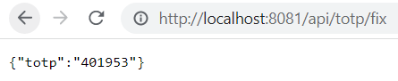
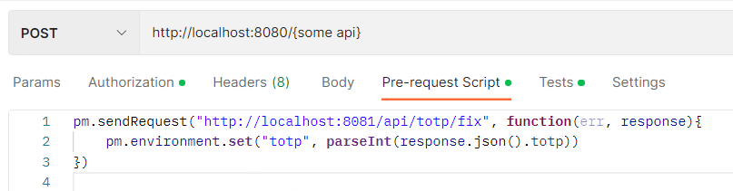
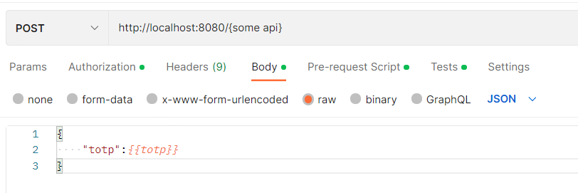

# Introduction
The totp-rest is tool for generate real time totp value.
The tool can be used to integrate with postman for automating the totp value insert.

# Installation
```shell
go install github.com/xh-dev-go/totp-rest@latest
```

# Start app
```shell
./totp-rest -secret {secret}
```



Add script to **"Pre-request Script"** as the screen capture.
```javascript
pm.sendRequest("http://localhost:8081/api/totp/fix", function(err, response){
    pm.environment.set("totp", parseInt(response.json().totp))
})

```


